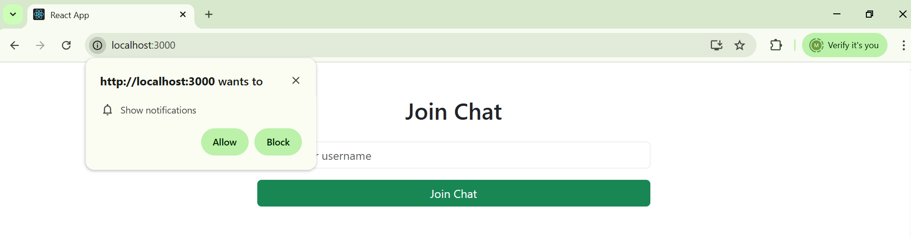
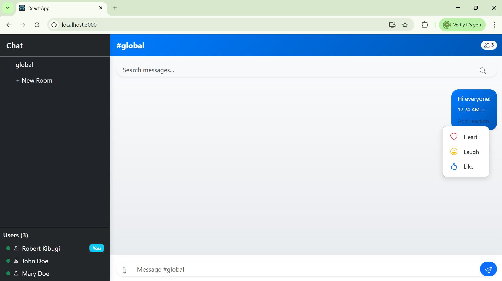
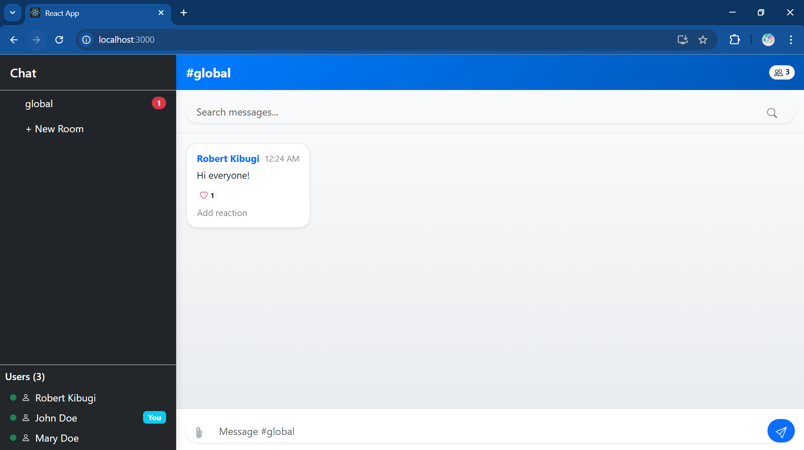
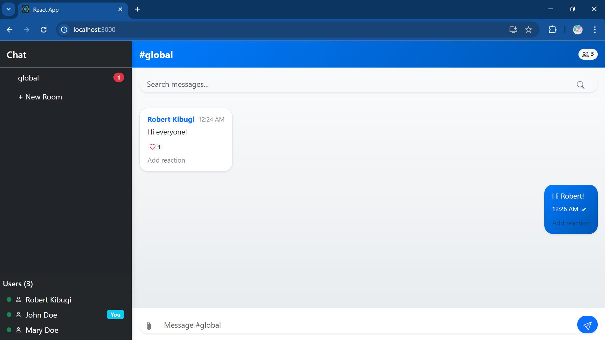
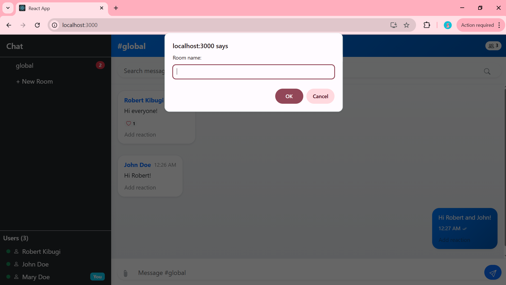
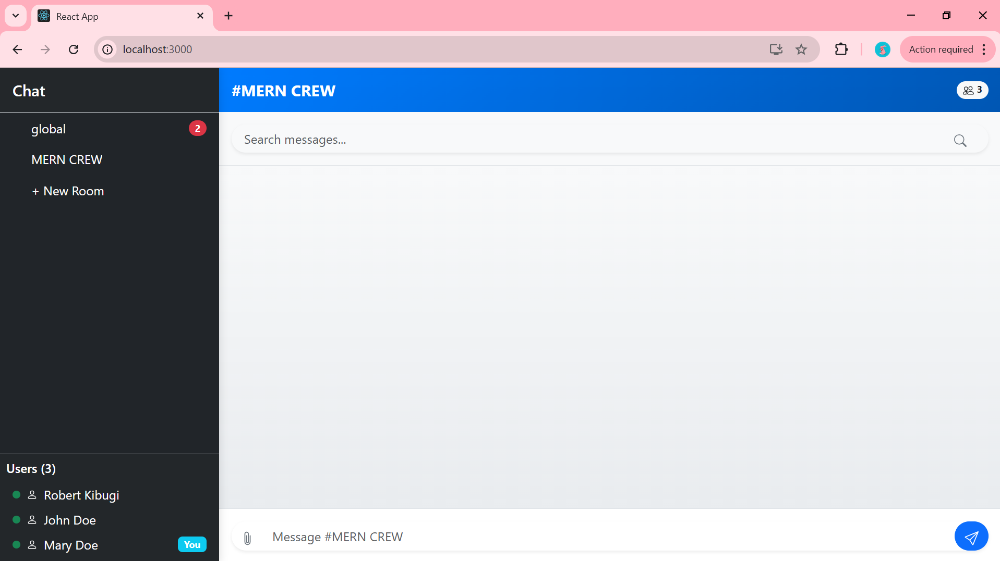
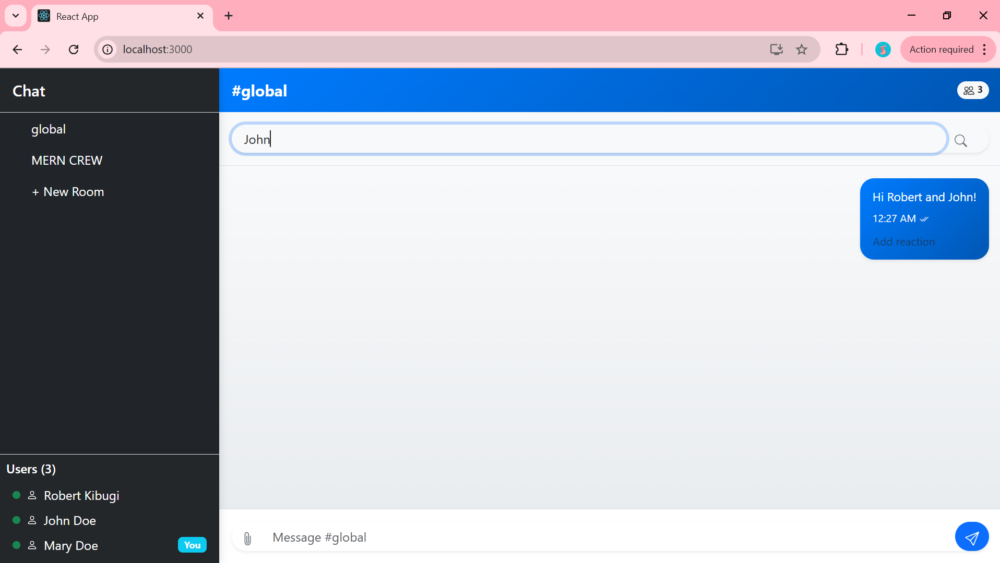
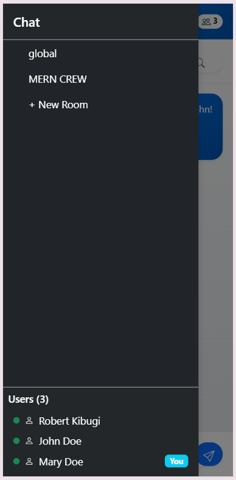

# Week 5: Real-Time Communication with Socket.io

## Objective

Build a **real-time chat application** using **Socket.io** that demonstrates **bidirectional communication** between clients and server, implementing features like **live messaging**, **notifications**, and **online status updates**.

---

## Tasks Implemented

### Project Setup

- Set up Node.js server with Express
- Configure Socket.io on the server side
- Created React front-end application
- Set up Socket.io client in the React app
- Established a basic connection between client and server

### Core Chat Functionality

- Implemented user authentication (username-based)
- Created a global chat room where all users can send and receive messages
- Display messages with sender's name and timestamp
- Show typing indicators when a user is composing a message
- Implemented online/offline status for users

### Advanced Chat Features

- Created private messaging between users
- Implemented multiple chat rooms or channels
- Added "user is typing" indicator
- Enabled file or image sharing
- Implemented read receipts for messages
- Added message reactions (like, love, etc.)

### Real-Time Notifications

- Send notifications when a user receives a new message
- Notify when a user joins or leaves a chat room
- Display unread message count
- Implemented sound notifications for new messages
- Added browser notifications (using the Web Notifications API)

### Performance and UX Optimization

- Implemented message pagination for loading older messages
- Added reconnection logic for handling disconnections
- Optimized Socket.io for performance (using namespaces, rooms)
- Implemented message delivery acknowledgment
- Added message search functionality
- Ensured the application works well on both desktop and mobile devices

  ## SCREENSHOTS

  

  

  

  

  

  

  

  
